## Hi there! 
I'm WindyStu, a student and still a total noob in DL and RL. :computer:

## :hammer_and_wrench: Technologies and Tools I use:

  
 
 
   

## 👨🏻‍💻 About Me:
- 🔭 I’m currently working on fine-tuning MedGemma for head CT & CTA diagnosis.
- 🌱 I’m currently learning DL & RL while being a total noob but trying really hard.
- 👯 I’m looking to collaborate on medical imaging, AI, and not burning GPUs.
- 🤔 I’m looking for help with making my model stop missing tiny aneurysms.
- 💬 Ask me about medical image data processing or basic DL stuff.
- 📫 How to reach me: Just find the guy crying over bad model performance.
- 😄 Pronouns: he/him
- ⚡ Fun fact: I can stare at a paper for 10 hours and still learn nothing.

  
